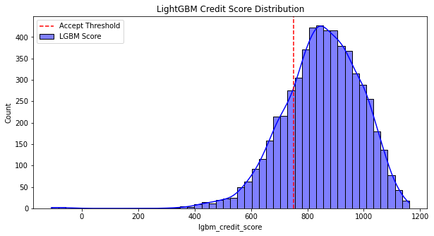
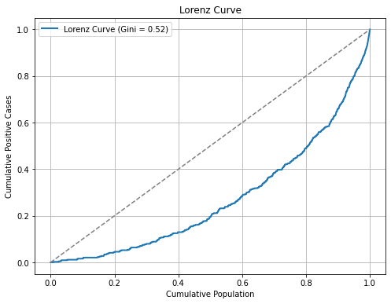

# Credit Risk Scorecard: A Data Science Approach

## 📌 Project Overview
This project demonstrates the end-to-end process of building a credit risk scorecard using machine learning and statistical techniques. The objective is to assess creditworthiness by developing a robust scoring model, leveraging **LightGBM** for predictions.

## 🛠 Key Steps in the Notebook

### 1️⃣ Data Preparation
- Loaded and explored the dataset.
- Handled missing values using **imputation techniques** to ensure data integrity.
- Encoded categorical variables using **Label Encoding**.

### 2️⃣ Feature Engineering
- Analyzed feature importance using **Information Value (IV)** to retain only the most predictive variables.
- Checked for multicollinearity using **Variance Inflation Factor (VIF)** and removed highly correlated features to enhance model stability.
- Standardised numerical features where necessary to improve model convergence.

### 3️⃣ Model Development
- Built **two models**: **Logistic Regression** and **LightGBM**.
- Applied **WoE binning** for Logistic Regression to transform continuous variables into risk categories.
- Evaluated both models, determining that **LightGBM performed best** in terms of predictive power and interpretability.
- Used **LightGBM** as the final model to generate credit scores for the scorecard.

### 4️⃣ Model Evaluation & Validation
- Assessed predictive power using the **Receiver Operating Characteristic (ROC) Curve** and **AUC score**.
- Examined risk separation using **score distribution analysis**.
- Measured model discrimination ability through the **Lorenz Curve (Cumulative Gains Curve)**.
- Calculated the **Gini coefficient** to assess model effectiveness at different risk thresholds.

## 📊 Key Visualisations

### 🔹 LightGBM Score Distribution
This visualisation shows how the LightGBM model assigns scores across applicants, highlighting separation between good and bad credit risks.

### 🔹 Lorenz Curve
The Lorenz curve illustrates the model's discriminatory power by comparing the cumulative proportion of good loans vs. bad loans.

## 🎯 Conclusion
This project presents a structured approach to credit risk modelling, demonstrating how **LightGBM can be effectively used to build a credit scorecard**. The notebook details each step, from data preprocessing to final model evaluation, providing a comprehensive guide to developing risk models in the financial sector.